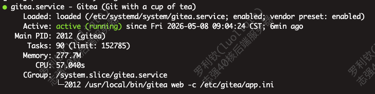
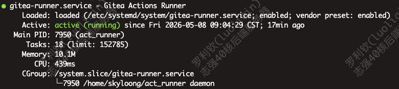

# Gitea 内网代码仓库重启指南

**服务器地址**：192.168.2.120
**Gitea 访问端口**：3000
**Gitea 安装路径**：`/usr/local/bin/gitea`（可执行文件）
**数据库服务**：Docker 容器运行的 MySQL

---

## 一、背景说明

2025年7月30日晚发生服务器意外断电，造成 Gitea 服务中断，且 `/usr/local/bin` 目录中的 `gitea` 可执行文件损坏。
于 7月31日重新下载安装 Gitea，并通过 `nohup ./gitea &` 启动服务恢复运行。

2026年5月8日补充：
重启后，还是需要手动启动才能启动项目，所以通过设置为系统项目来自动启动。
具体设置方法见下方附录说明：

现在使用sudo systemctl start gitea来重启gitea

---

## 二、重启后的操作流程说明

要检查gitea及action_runner是否都重启成功

### 1. 登录服务器

使用jumpServer堡垒机登录志强120服务器：

---

### 2. 检查gitea是否启动
使用以下指令检查
```bash
sudo systemctl status gitea
```


如果出现上方提示，说明启动成功

如果没有启动，使用
```bash
sudo systemctl start gitea
```
---

### 3. 检查Runner是否启动

```bash
sudo systemctl status gitea-runner
```


如果出现以上结果，说明启动成功

如果没有启动,使用以下命令来启动

```bash
sudo systemctl start gitea-runner
```

---

### 2. 检查 Gitea 可执行文件是否存在

```bash
ls -l /usr/local/bin/gitea
```

* 若文件已损坏或不存在，请按下方方法重新下载：

```bash
cd /usr/local/bin
sudo rm -f gitea  # 删除旧文件（如已损坏）

# 根据系统架构下载最新版（例如 Linux AMD64）
sudo wget -O gitea https://dl.gitea.io/gitea/latest/gitea-1.21.3-linux-amd64

# 添加执行权限
sudo chmod +x gitea
```

---

### 3. 检查数据库容器是否正常运行

数据库为 Docker 安装的 MySQL，请执行：

```bash
docker ps | grep mysql
```

* 若容器未运行，启动数据库容器：

```bash
docker start <mysql_container_name_or_id>
```

> ⚠ 如果你不知道容器名，可先用 `docker ps -a` 查看所有容器。

---

### 4. 启动 Gitea 服务

前往 Gitea 数据目录（例如 /home/git/gitea 或实际目录），并以后台方式运行：

```bash
cd /home/git/gitea  # 或你的实际目录
nohup /usr/local/bin/gitea web &  # 后台运行
```

> **提示**：如果你希望更持久管理 Gitea，建议使用 systemd 方式启动，见附录。

---

### 5. 验证是否启动成功

访问网页：

```
http://192.168.2.120:3000
```

或使用命令检查端口监听：

```bash
netstat -tuln | grep 3000
```

---

## 📂 附录：使用 systemd 管理 Gitea（推荐）

### 1. 创建 systemd 服务文件

```bash
sudo vim /etc/systemd/system/gitea.service
```

内容如下（请按你的安装路径调整）：

```ini
[Unit]
Description=Gitea (Git with a cup of tea)
After=syslog.target
After=network.target
Requires=mysql.service  # 如数据库使用本地docker容器，可去掉或改为docker

[Service]
RestartSec=2s
Type=simple
User=git
Group=git
WorkingDirectory=/home/git/gitea
ExecStart=/usr/local/bin/gitea web
Restart=always
Environment=USER=git HOME=/home/git

[Install]
WantedBy=multi-user.target
```

### 2. 启动并设置开机自启

```bash
sudo systemctl daemon-reexec
sudo systemctl daemon-reload
sudo systemctl enable gitea
sudo systemctl start gitea
```

---

## 总结

若下次停电，恢复步骤如下：

1. 确保 MySQL Docker 容器运行。
2. 检查 Gitea 可执行文件是否完好，如损坏则重新下载。
3. 使用 `nohup` 或 `systemctl` 启动 Gitea 服务。
4. 验证 3000 端口是否正常开放，网页是否可访问。


