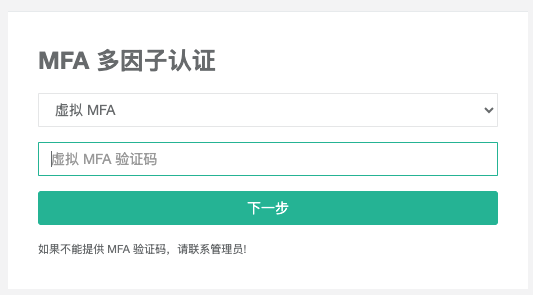

# JumpServer堡垒机MFA登录失败的解决记录

> 罗利钦 ・Modified March 20



登录JumpServer时绑定了MFA验证码，但是后面一次的使用中，即使输入正确的验证码也显示验证码错误。

---

## 问题结论

服务器时间同步不正常，导致无法验证。原因是182服务器的`nameServer`被关闭，导致无法正确解析`ntp`服务器的域名地址。

---

## 问题过程

182ubuntu服务器的DNS解析是`systemd-resolved`管理的：

```bash
systemctl status systemd-resolved  ## 使用systemd-resolved的启动状态

systemctl restart systemd-resolved ## 如果是关闭的，使用该命令启动
