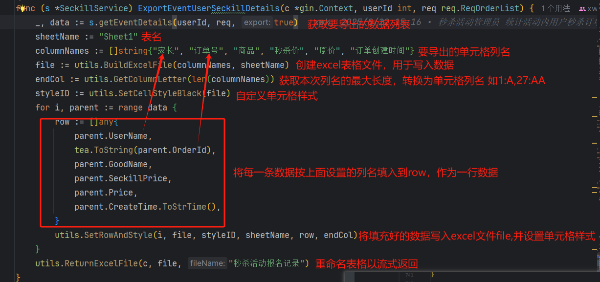

# excel表格导出

## 使用教程




## 方法解析

### 1.创建Excel文件

```go
//传入要导出的单元格列名和表名
// 如[]string{"家长", "订单号", "商品", "秒杀价", "原价", "订单创建时间"}, "Sheet1")
func BuildExcelFile(columnNames []string, sheetName string) *excelize.File {
	// 创建Excel文件
	file := excelize.NewFile()
	
	//设置单元格格式
	for i, colName := range columnNames {
        //将整数转换为 Excel 工作表列标题。例如，将 36 转换为列标题 AK
		cellName := excelize.ToAlphaString(i) + "1" 
        //设置列名
        file.SetCellValue(sheetName, cellName, colName)
        //设置此单元格格式，SetCellStyleBlack()函数由自己自由设置
		file.SetCellStyle(sheetName, cellName, cellName, SetCellStyleBlack(file))
        //设置单元格宽度，因为要写入表格的数据的长度不一，若要用 某一列的数据的最大长度 作为 单元格长度，需要遍历此列下单所有数据才能确定，造成执行时间过长(若多列单元格都确定最大长度)， 现采用 当前列名长度/自定义长度 作为该列长度
		file.SetColWidth(sheetName, cellName, cellName, float64(len(colName)))
	}
	return file
}
```

### 2.自定义设置单元格格式

```go
// 设置execl单元格为黑色居中
func SetCellStyleBlack(f *excelize.File) int {
    styleID, err := f.NewStyle(`{
       "alignment" : {
          "horizontal": "center",//水平居中
          "vertical": "center" //垂直居中
       }
       //若有其他需要从此添加
    }`)
    if err != nil {
       panic(err)
    }
    return styleID
}
```

### 3.将数字转换为Excel列字母

```go
// 将数字转换为Excel列字母（1→A, 2→B, ..., 26→Z, 27→AA, ...）
func GetColumnLetter(colNum int) string {
	letter := ""
	for colNum > 0 {
		colNum--
		letter = string(rune('A'+colNum%26)) + letter
		colNum /= 26
	}
	return letter
}
```

### 4. 设置除列名外的每一行数据及单元格样式

```go
func SetRowAndStyle(i int, file *excelize.File, styleID int, sheetName string, row []interface{}, endCol string) {
	currentRow := i + 2 //跳过列名行 第二行开始
	startCell := fmt.Sprintf("A%d", currentRow) //第n行开始列
     endCell := fmt.Sprintf("%s%d", endCol, currentRow) //第n行结束列
	file.SetSheetRow(sheetName, startCell, &row) //将row中数据填入file
	file.SetCellStyle(sheetName, startCell, endCell, styleID) //设置此行数据所在的单元格样式
}
```

### 5.返回写入完成的表格文件

```go
// 在file中写入数据行之后---》发送excel文件流到前端
func ReturnExcelFile(c *gin.Context, file *excelize.File, fileName string) {
    //转换为byte数组
	fileBytes, err := file.WriteToBuffer()
	if err != nil {
		c.JSON(http.StatusInternalServerError, gin.H{"error": err.Error()})
		return
	}
	// URL 编码中文文件名
	encodedFileName := url.QueryEscape(fileName)
	// 设置响应头
	c.Header("Content-Disposition", "attachment; filename="+encodedFileName)
	c.Header("Content-Type", "application/vnd.openxmlformats-officedocument.spreadsheetml.sheet")
    //以流式返回
	c.Data(http.StatusOK, "application/octet-stream", fileBytes.Bytes())
}
```

