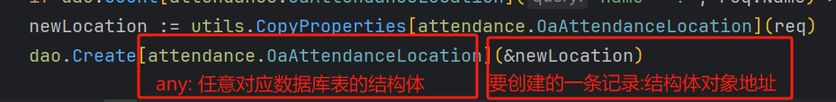
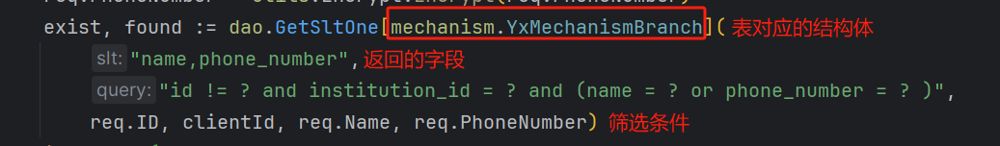
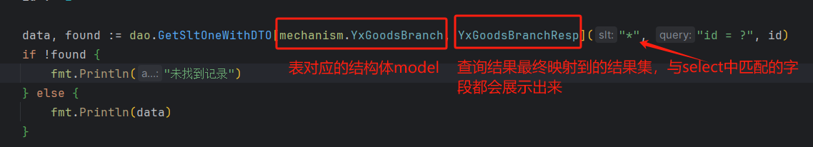
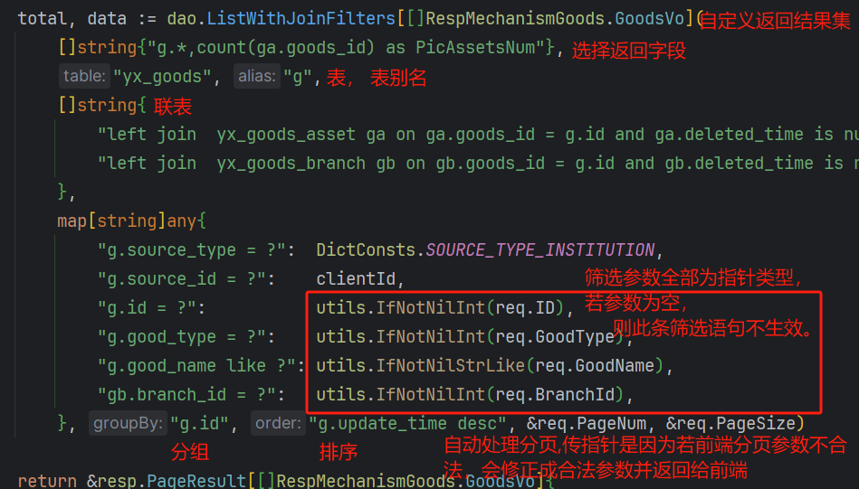
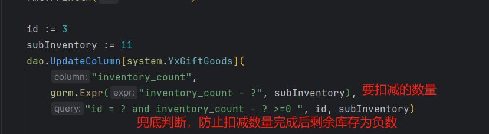
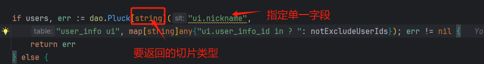
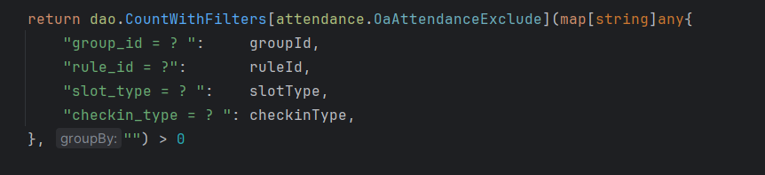
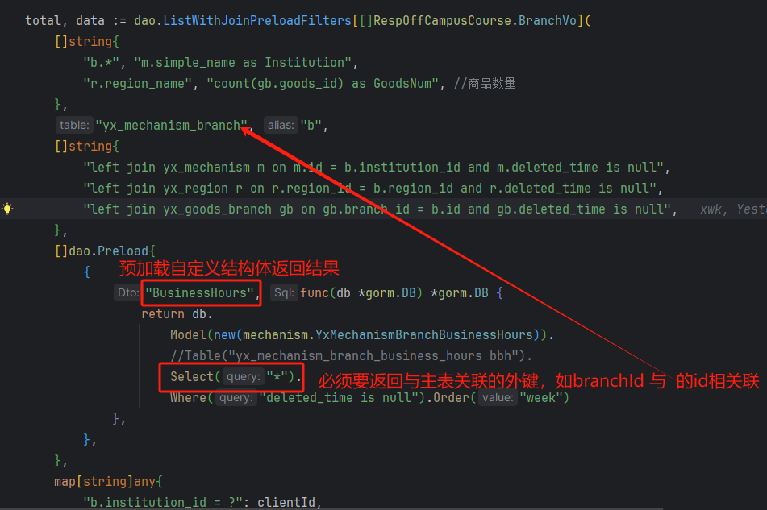
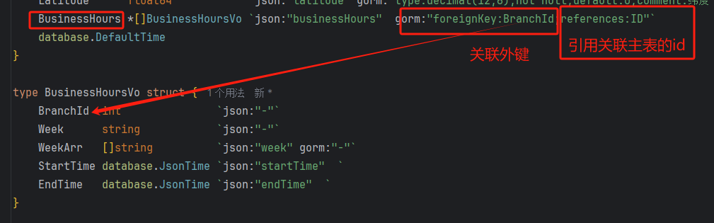

# 注意:

```markdown
以下所有数据库操作返回错误后 全部交给panic recover捕获错误,
优点:业务层不再处理sql错误，简化代码,专注业务处理
缺点:在定时任务中执行sql出现错误后，会出现线程被panic结束导致程序退出
解决方法：给定时任务增加recover捕获错误
```

```go
// 定时任务安全执行器-防止panic导致程序退出
func runSafely(jobName string, jobFunc func()) {
	defer func() {
		if r := recover(); r != nil {
			utils.LoggerErrInfo(fmt.Errorf("定时任务 %s 执行失败(panic): %v", jobName, r))
		}
	}()
	//log.Printf("开始执行定时任务: %s", jobName)
	//start := time.Now()
	jobFunc()
	//log.Printf(" 定时任务 %s 执行完成, 耗时: %v", jobName, time.Since(start))
}
```


## 创建

```go
func Create[T any](data *T) {
    err := DB.Create(&data).Error
    if err != nil {
       panic(err.Error())
    }
}
//批量创建需要开启事务保证原子操作
func CreateBatches[T any](data T, size int) {
	err := DB.Transaction(func(tx *gorm.DB) error {
		return tx.CreateInBatches(&data, size).Error
	})
	if err != nil {
		panic(err.Error())
	}
}
```

使用



## [单条]数据查询

gorm的First方法若没有找到数据会报ErrRecordNotFound的错误 但不是业务错误，需要单独判断，

若报 ErrRecordNotFound 的错误 直接返回 false 

T any 泛型 可以传任意 结构体对象或指针，通常使用指针

### 1.查询以model(表实体)返回

```go
func GetSltOne[T any](slt, query string, args ...any) (T, bool) {
	var data T
	db := DB
	if slt != "" {
		db = db.Select(slt)
	}
	err := db.Where(query, args...).First(&data).Error
	if errors.Is(err, gorm.ErrRecordNotFound) {
		return data, false
	}
	if err != nil {
		panic(err)
	}
	return data, true
}
```

使用  




### 2.查询并映射结果集

```go
func GetSltOneWithDTO[Model, DTO any](slt, query string, args ...any) (DTO, bool) {
    var data DTO
    db := DB.Model(new(Model))//model 无需传指针  new(Model)已经创建了一个指针对象
    if slt != "" {
       db = db.Select(slt)
    }
    err := db.Where(query, args...).First(&data).Error
    if errors.Is(err, gorm.ErrRecordNotFound) {
       return data, false
    }
    if err != nil {
       panic(err)
    }
    return data, true
}
```




## [多条]数据查询 

此处 只展示 查询多条数据 含联表、分页、排序、分组的所有情况 ，其他情况(不分页、不联表等)可根据此封装单独修改一份

```go
func ListWithJoinFilters[DTO any](slt []string, table, alias string, joins []string, filters map[string]any, groupBy, order string, page, pageSize *int) (total int64, result DTO) {
    
	db := DB.Select(strings.Join(slt, ",")) //Model(new(Model)).
	if alias != "" {
		db.Table(fmt.Sprintf("%s %s", table, alias)).
			Where(fmt.Sprintf("%s.deleted_time is null", alias))
	} else {
		db.Table(table)
	}
	if groupBy != "" {
		db = db.Group(groupBy)
	}
	if order != "" {
		db = db.Order(order)
	}
	for _, join := range joins {
		db.Joins(join)
	}
	for key, value := range filters {
		if value != nil {//map中的指针参数不为空时才加入条件筛选
			switch v := value.(type) {
			case []any:
				db = db.Where(key, v...) // 使用...展开切片
			default:
				db = db.Where(key, v) // 单个参数直接传递
			}
		}
	}
	db.Count(&total)
	if total <= 0 {
		return 0, result
	}
    checkQueryPage(page, pageSize)
	db.Offset(getOffsetVal(*page, *pageSize)).Limit(*pageSize).Scan(&result)
	return total, result
}
func IfNotNilInt[T any](ptr *T) any {//判断当前指针int参数是否为空
	if ptr != nil {
		return *ptr
	}
	return nil
}
func IfNotNilStr[T any](ptr *T) any {//判断当前指针str参数是否为空
	if ptr != nil {
		return fmt.Sprintf("%%%v%%", *ptr)//不为空时加上% %进入模糊查询
	}
	return nil
}
func checkQueryPage(pageNum, pageSize *int) {
	switch {
	case *pageSize >= 100:
		*pageSize = 100
	case *pageSize <= 0:
		*pageSize = -1
	}
	if *pageNum <= 0 {
		*pageNum = -1
	}
}
func getOffsetVal(pageNum int, pageSize int) int {
	if pageNum <= 0 && pageSize <= 0 {
		return -1
	} else {
		return (pageNum - 1) * pageSize
	}
}
```

解析

```markdown
DTO any : 为查询结果映射到的自定义结构体，通常为返回给前端的数据结构
slt []string :  列表所需返回的字段 写成[]string为了保证代码清晰度
alias ：查询主体表(from 后的表为主体表)的别名 ，默认查询 表中未删除的记录
        1.省略每次查询都需要重复写未删除过滤
        2.简化主体表表名 在联表中的使用
joins []string ： 多联表条件 
filters map[string]any : 条件过滤 例：
					filters map[string]any {
						"id = ? " : 1
						"start_time > ?  or  start_end < ?" : []any{1,2}
					}
sql	： id = 1 and (start_time > 1  or  start_end < 2)		
用 占位符 进行条件过滤 可以匹配所有条件筛选的情况 ，每一个[k,v]就是一个与(and)条件,
采用这种方式可以灵活进行各种条件筛选

groupBy, order : (多)分组 (多)排序 例 "table.id,table.name" 
page, PageSize : 分页
先查询列表数量，若数量为0 ,则完全不需要去查询列表 ,避免浪费sql资源
最终返回列表数量和结果集

checkQueryPage() 校验合法的分页参数 
getOffsetVal() 获取偏移量
```

使用




## 更新

gorm 在更新一个结构体(一条记录)时 , 结构体为0、false、nil 的值 无法更新到数据库

```go
func Update[T any](data *T, slt ...string) {
    if len(slt) > 0 {
       DB.Model(&data).Select(slt).Updates(&data)
       return
    }
    err := DB.Model(&data).Debug().Updates(&data).Error
    if err != nil {
       panic(err)
    }
}
```

解决方法 

1 指定字段(Select)更新0值  2. 使用map更新

```go
func UpdatesMap[T any](filters, maps map[string]any) {
	db := DB.Model(new(T))
	for key, value := range filters {
		if value != nil {
			switch v := value.(type) {
			case []any:
				db = db.Where(key, v...) // 使用...展开切片
			default:
				db = db.Where(key, v) // 单个参数直接传递
			}
		}
	}
	if err := db.Updates(maps).Error; err != nil {
		panic(err)
	}
}
```

使用


单一字段更新 如库存增减




## 删除

// [批量]删除数据, 通过条件控制可以删除单条数据

一般执行逻辑删除、若需要物理删除 + Unscoped()

```go
func Delete[T any](query string, args ...any) {
	err := DB.Where(query, args...).Delete(new(T)).Error
	if err != nil {
		panic(err)
	}
}
# 用法
dao.Delete[表对应的结构体]("id = ?", id)
```


## 获取列表指定一个字段 以数组返回

若需要联表获取 与上述 多条数据查询同理

```go
func Pluck[DTO any](slt, table string, filters map[string]any) (ans []DTO, err error) {
    db := DB.
       //Model(new(Model)).
       Table(table).
       Select(slt).
       Where("deleted_time IS NULL")
    for key, value := range filters {
       if value != nil {
          switch v := value.(type) {
          case []any:
             db = db.Where(key, v...) // 使用...展开切片
          default:
             db = db.Where(key, v) // 单个参数直接传递
          }
       }
    }
    err = db.Pluck(slt, &ans).Error
    return ans, err
}
```

使用




## 统计数量

条件过滤和联表 和上述查询列表同理

```go
func CountWithFilters[T any](filters map[string]any, groupBy string) int64 {

    db := DB.
       Model(new(T))
    if groupBy != "" {
       db = db.Group(groupBy)
    }
    for key, value := range filters {
       if value != nil {
          switch v := value.(type) {
          case []any:
             db = db.Where(key, v...) // 使用...展开切片
          default:
             db = db.Where(key, v) // 单个参数直接传递
          }

       }
    }
    var total int64
    db.Count(&total)
    return total
}
```




## 预加载(一对多、多对多的情况)

```go
type Preload struct {//自定义预加载结构体传参
	Dto string
	Sql func(db *gorm.DB) *gorm.DB
}

func ListWithJoinPreloadFilters[DTO any](slt []string, table, alias string,
	joins []string,
	preloads []Preload,
	filters map[string]any, groupBy, order string, page, pageSize *int) (total int64, result DTO) {

    .......其他条件筛选同上，不再赘述..........
	
	if err := db.Count(&total).Error; err != nil {
		panic(err)
	}

    if total <= 0 { //当主表记录=0时，直接返回结果 (此时预加载结果一定为空,没必要去执行预加载)
		return 0, result
	}
    
	if preloads != nil { 
		for _, pre := range preloads {
			db.Preload(pre.Dto, pre.Sql)
		}
	}
	checkQueryPage(page, pageSize)
	if err := db.Offset(getOffsetVal(*page, *pageSize)).Limit(*pageSize).Find(&result).Error;err != nil {
		panic(err)
	}
	return total, result
}
```


用法






