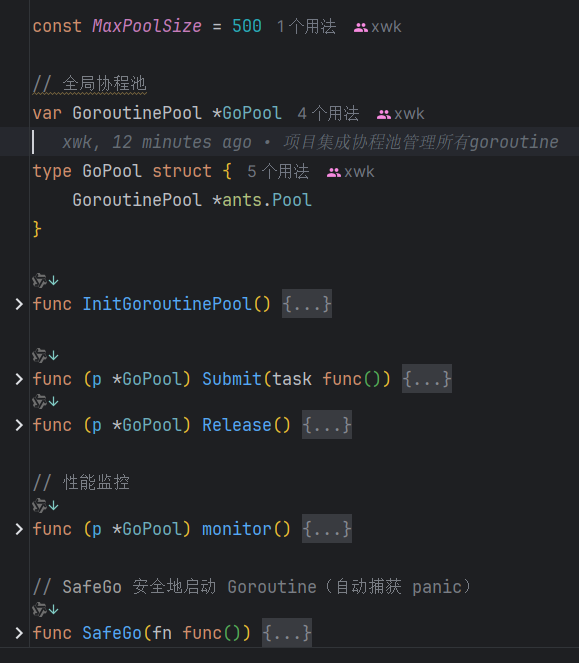
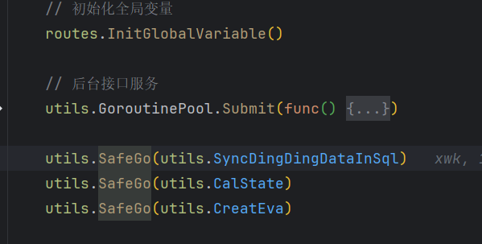

虽然可以使用 Go 内置的 goroutines 来处理并发任务，但没有调度和控制的 goroutine 很容易导致系统资源耗尽

 ants 作为 goroutine 池来优化 Go 应用程序 

已封装通用协程池 ，包括池的初始化、发起goroutine 、性能监控、资源释放

使用方法:

在初始化 协程池之后 通过 池来创建新的goroutine 

使用safeGo()来封装 协程池 submit 的原因： 主协程无法捕获到子goroutine中发生的异常情况 

https://cloud.tencent.com/developer/article/2486466