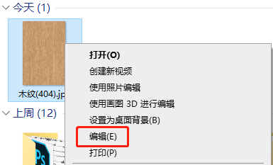
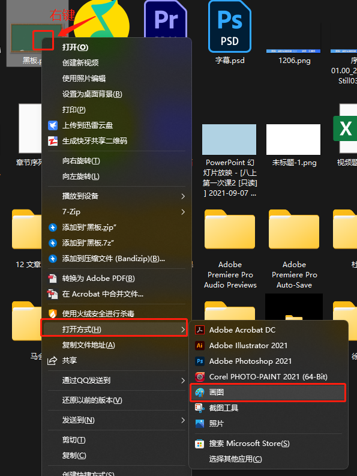
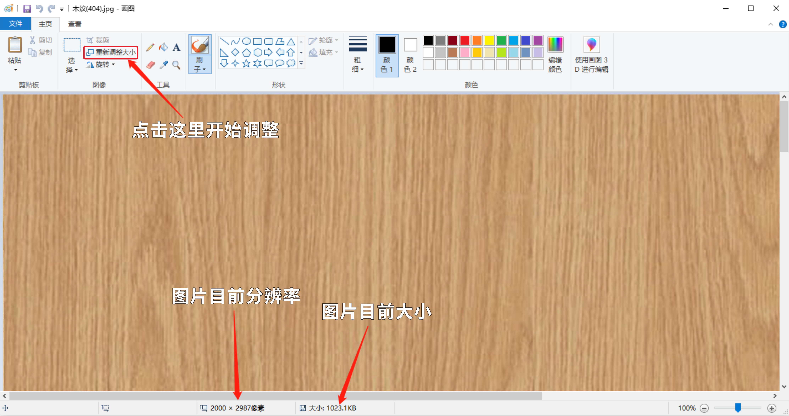
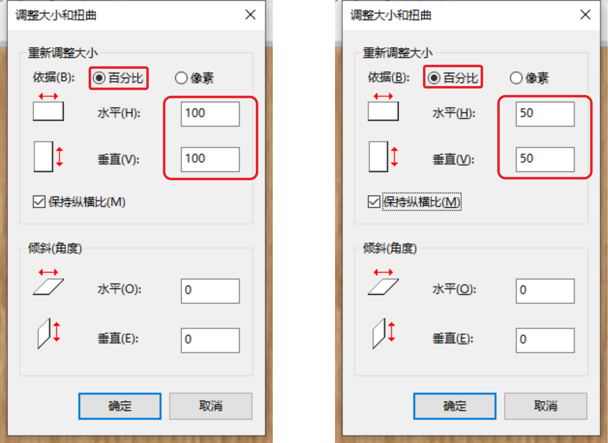
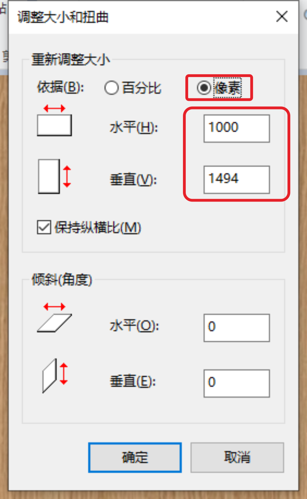
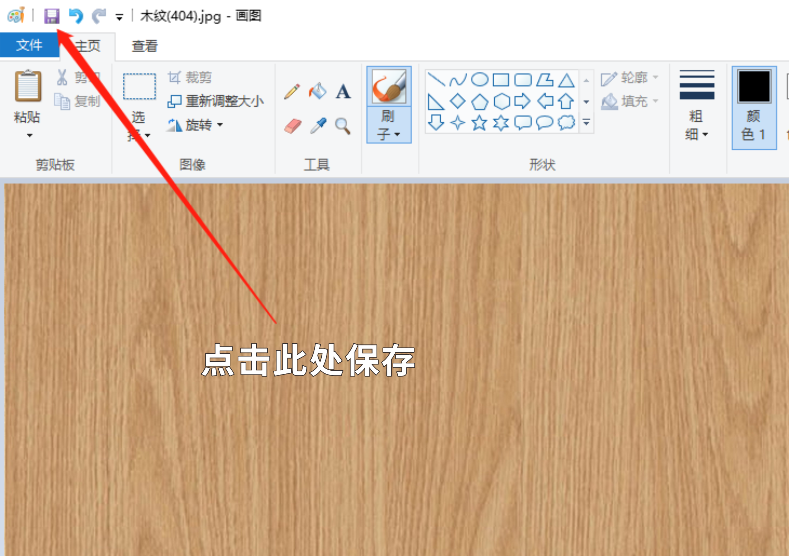
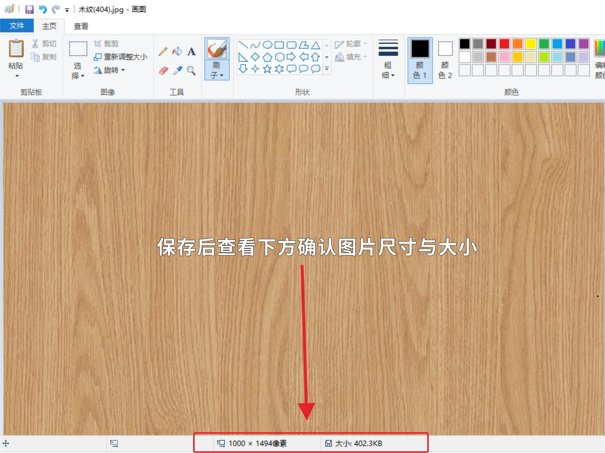

# 在Windows电脑上如何修改图片尺寸与大小

#### 我们在上传图片时，经常会上传失败，遇到【图片大小超过4M】【仅支持800*800分辨率】的弹窗。

#### 这时候就需要我们手动调整图片尺寸与大小。

##### 1.我们先右键点击需要修改的图片，选择编辑。

##### 2.在Win11中，则需要在右键菜单中选择打开方式-画图

##### 3.进入画图软件之后，系统将自动把图片在画图工具中打开，下方箭头处显示目前图片的分辨率与大小，我们来点击上方【重新调整大小】按钮修改图片尺寸大小。

##### 4.在弹出的窗口中选择【依据百分比】就可以直接修改图片尺寸，修改至50%后图片大小会在原图片大小的1/2与1/4之间。

##### 5.若上传时有要求图片分辨率，就需要我们选择【依据分辨率】来修改尺寸。假如此次上传要求图片分辨率不超过800*800，就要在水平与垂直中选择分辨率最大一项修改至800。

##### 6.修改尺寸后点击上方【软盘】图标进行保存。

也可以点击文件→另存为，不覆盖保存

##### 7.保存后可以在下方直接查看当前图片的尺寸与大小，符合标准就可以直接关闭画图工具了。

以上就是修改图片尺寸与大小的方法。