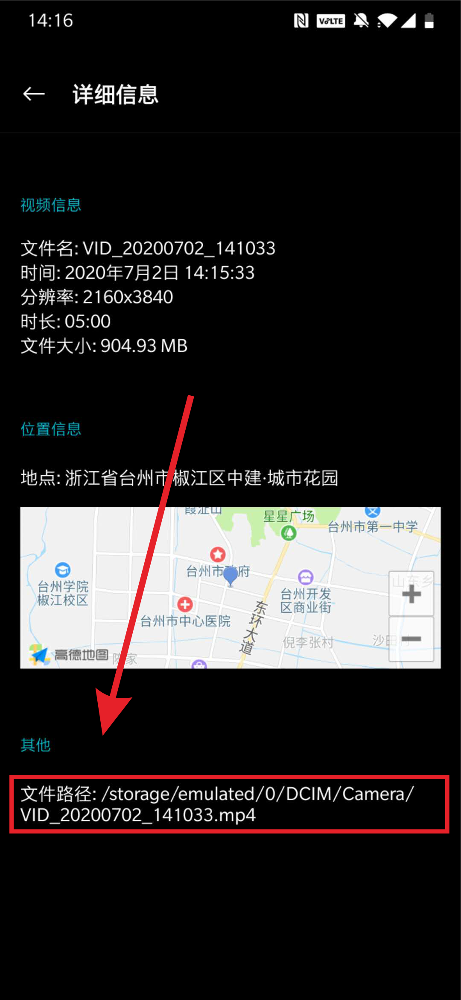
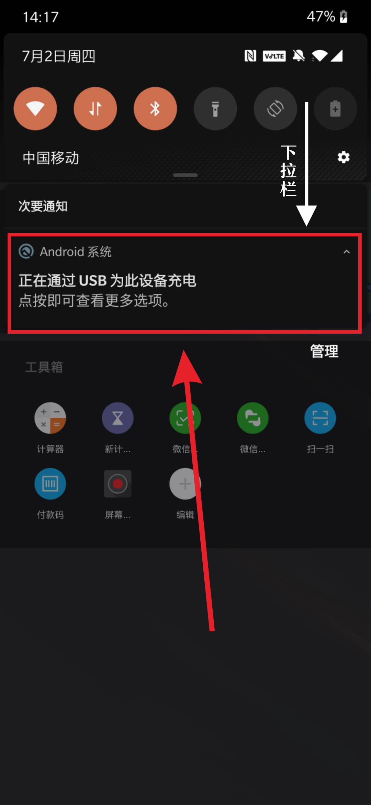
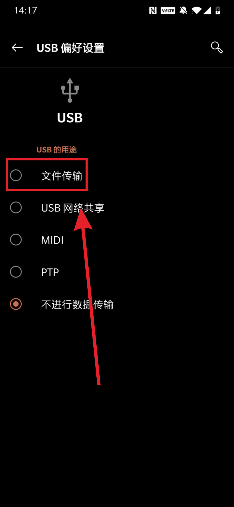
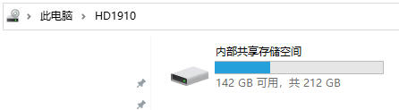
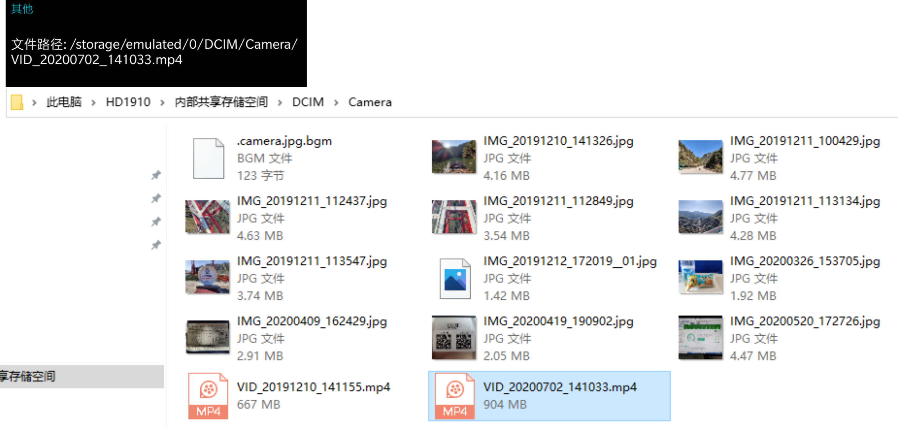

# 如何将手机的视频有线传输到电脑上（安卓手机）

###### 教你如何将安卓手机上的拍课视频上传到前台电脑或者个人电脑上

##### 1.第一步先在手机相册中找到想要上传的视频，点击三个点的按钮。（不同手机的按键位置与文字会稍有不同）

##### 2.然后点击[详细信息]来查看文件的详细信息。（不同手机的按键位置与文字会稍有不同）

##### 3.在详细信息页面找到视频存储的文件路径。（不同手机的界面布局会稍有不同）

##### 

##### 4.用数据线把手机与电脑连接。

##### 5.在手机下滑菜单（通知栏）内找到关于USB的设置选项。

##### 6.选择[文件传输]（不同手机的选项位置与文字描述会稍有不同）

##### 7.手机上设置完毕后，电脑会像插U盘一样弹出手机内的储存空间。

##### 8.根据第三步的文件路径来查找视频的位置，大部分Android手机的相册路径都在/DCIM/Camera/。

##### 9.右键点击想要上传的视频文件，粘贴至电脑任意盘符下。（大文件传输至少需要5~10分钟，请把手机放在桌面上，传输期间不要碰到数据线。)

