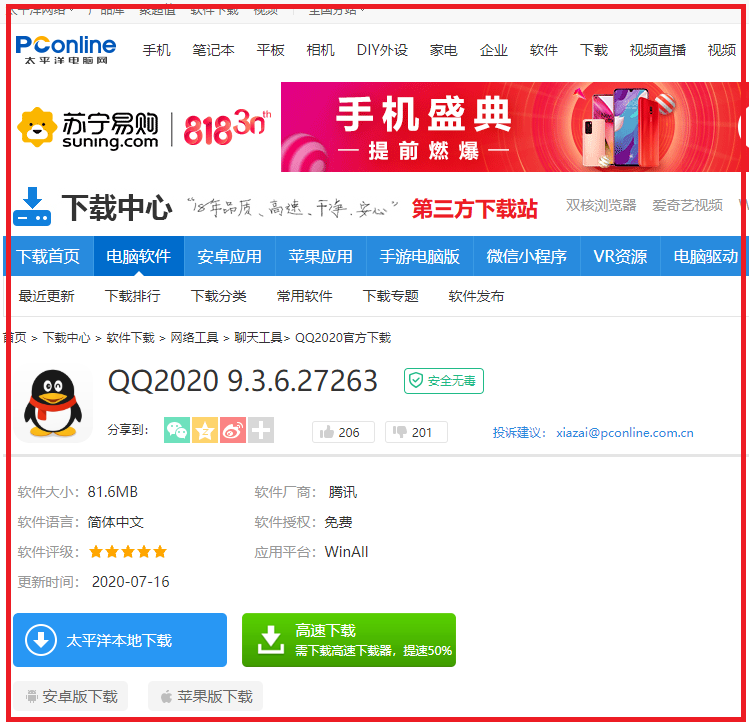

# 如何正确的查找官方网站来下载安装纯净软件

### 教你下载纯净版软件

##### 1.首先我们使用搜索引擎来搜索想要下载的软件。

使用百度、搜狗、必应等搜索引擎，搜索关键词

##### 2.在搜索结果里找到官方网站。

###### 注意观察

###### 注意观察

##### 3.官方网站与非官方下载站的区别。

这个是QQ音乐的官方下载地址

这个是QQ的官方下载地址

这是第三方下载站

这个也是第三方下载站

###### **官方网站都有它的品牌风格，而第三方下载站都长得差不多**

##### 4.安装软件时要实时关注勾选栏，来避免例如“QQ捆绑腾讯安全中心”“WPS捆绑金山毒霸”的情况。

一定要实时注意，多观察，远离软件捆绑。