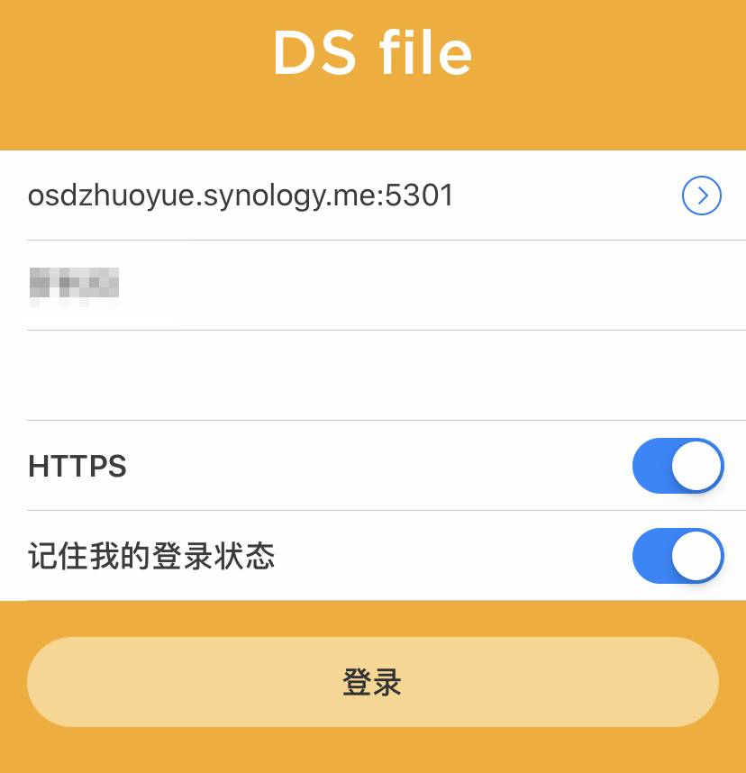

# 常见问题总结

##### 在这里你也许可以找到你需要解决的问题

### 设计申请方法

申请方法：请找到钉钉-审批（常用应用）-资讯设计申请（资讯总务），填写申请表单后提交后等待审批完成。

### 电子设备租借

##### *Q：怎么申请租借电子设备？*

A：请找到钉钉-审批（常用应用）-电子设备租借（资讯总务），填写申请表单后提交后等待审核完成！

##### *Q：什么时候可以领取？*

A：当审核完成后，即可在资讯课上班时间来总部找资讯课老师领取！

##### *Q：什么时候还？*

A：没有特殊情况下，租借日期的下周三17:30半前必须把电子设备归还到总部资讯课！

### 卓越云

##### *Q：如何访问卓越云？*

电脑端请在浏览器输入网址：https://osdzhuoyue.synology.me:5301

苹果手机在App Store搜索DS file

安卓（包括华为）手机下载DS file请前往：https://wws.lanzouw.com/iOShn081b0ij?w1

##### *Q：我的账号密码是什么？*

A：账号为姓名全拼或英文名+姓氏（如WangXiaoming、WendyLiu），默认密码为所提供手机号码的后六位。

##### *Q：卓越云无法上传视频，出现“抱歉，此用户账户权限不足，无法执行此操作”*

A：该用户没有上传文件到该文件夹的权限，可能是：

1. 选择了错误的文件夹，若是教学视频请选择正确的科目进行上传
2. 一般新老师没有上传的权限，请联系行政或者教务长帮忙上传。

##### *Q：DS File手机端APP无法登入；*

A：出现这个的原因可能是：

1. 账号密码错误；请确保自己的账号密码没有输入错误，密码若忘记可以通过【忘记密码】来找回。

2. DS File地址输入错误；卓越云的正确地址为https://osdzhuoyue.synology.me:5301，并要把后面的HTTPS勾上。

3. 如果之前一直按照第二条的方式登录，却在某天突然无法登录的话，请删除“:5301”，并要把后面的HTTPS取消勾选。

   

请按上图的格式进行设置

###### 内容还在持续更新中，敬请期待......