# **怎么压缩视频？（格式工厂使用教程）**

#### 格式工厂可用于视频、音频文件的合并、转换与压缩，简单易懂。

以下教程为格式工厂4.9.0版本，没有软件可以在卓越云/卓越资源库/常用软件安装包/下面找到FormatFactory_setup 下载安装。

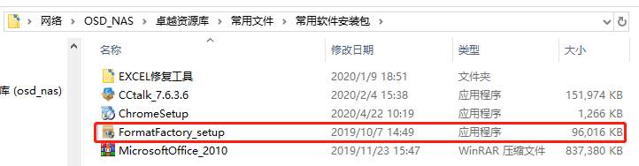

##### 1、打开格式工厂。

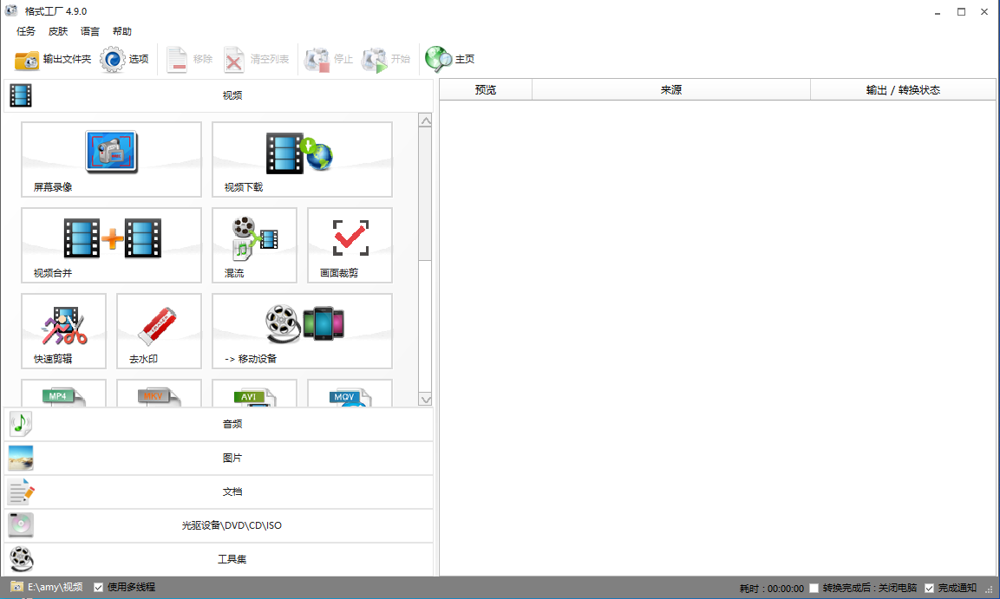

##### 2、打开软件后找到“视频”下方的“MP4”，单击打开。如下图：

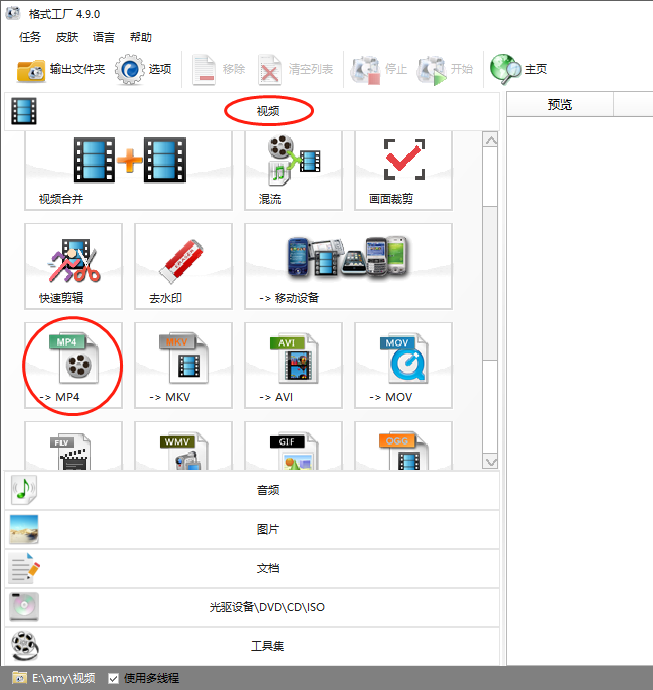

##### 3、点击添加文件，选择需要压缩的视频，然后打开。如下图：

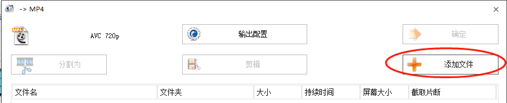

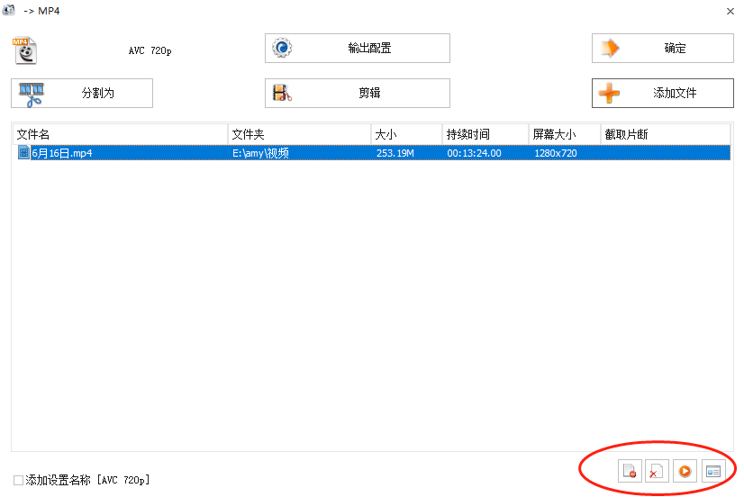

如果选错视频，可以在上图中的红圈处，有移除和清空列表等选项进行移除，然后重新添加文件。

##### 4、点击输出配置。更改为AVC720p，点击确定。如下图：

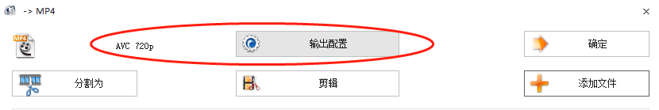

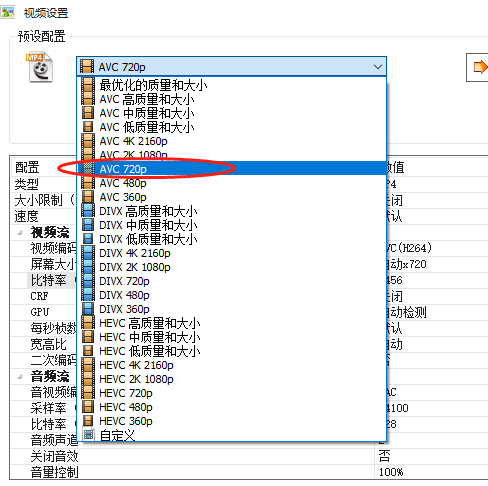

如果需要压缩特别小的视频，就需要调整比特率，比如微信视频不能超过25M的，可以把比特率调整到800，甚至更小一点。如下图：

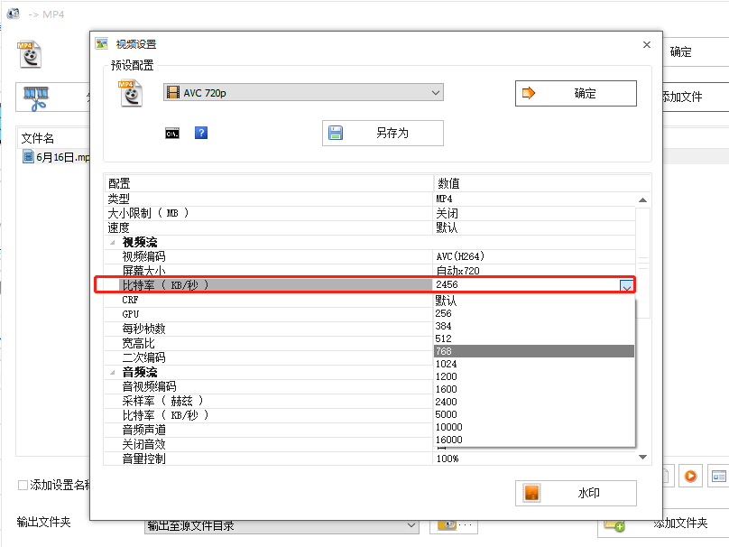

##### 5、更改输出文件夹。在输出文件夹右边的下拉框里，选择自己方便找到压缩完的视频。如下图：

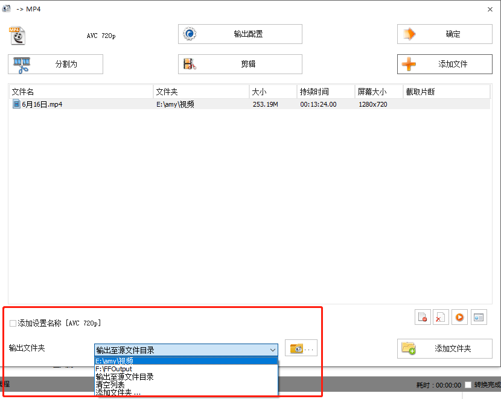

##### 6、完成以上操作就可以点击“确定”，然后点击“开始”，等视频转化完成就好了。

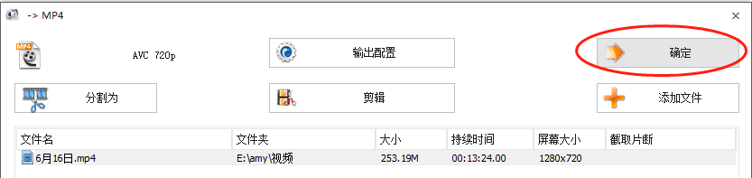

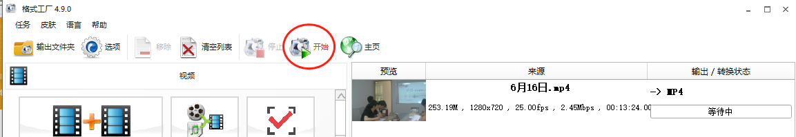

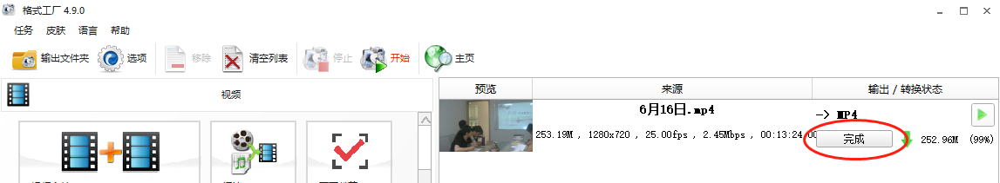

这样就完成了。
