# 电子设备常用接口科普

#### 本教程会简单地科普一下常用的电子设备接口

##### 一、USB

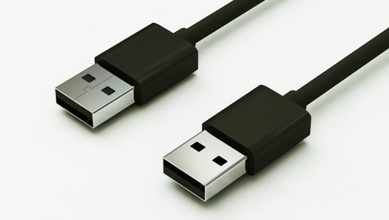

图为USB Type-A，是最常见的USB接口

USB是通用串行总线的英文缩写，Type A即是我们经常使用的USB接口，该标准一般使用于个人电脑，是应用最广泛的接口标准。

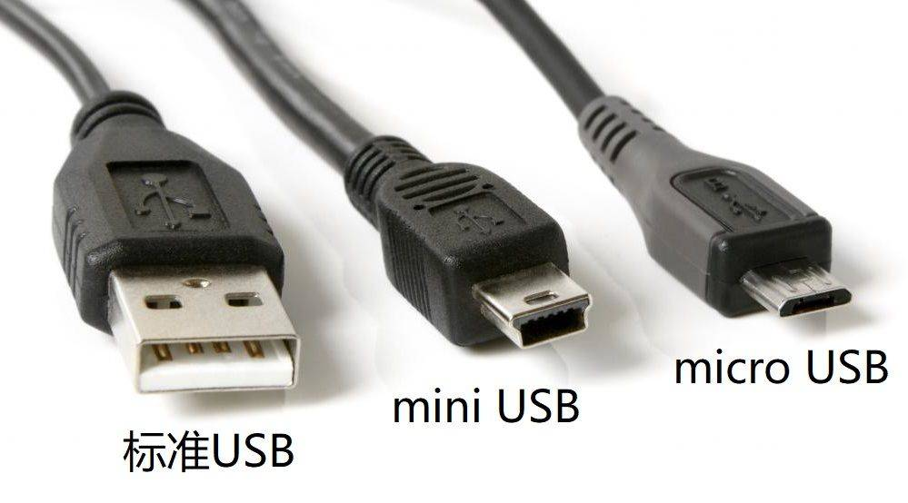

与标准USB（Type-A）接口不同，mini USB（已淘汰）与micro USB（淘汰中）经常出现在移动设备上。

mini USB常见于功能机时代的老手机与老的低功率电器上，而micro USB常见于最近十年内的老款安卓手机以及低功率电器上。

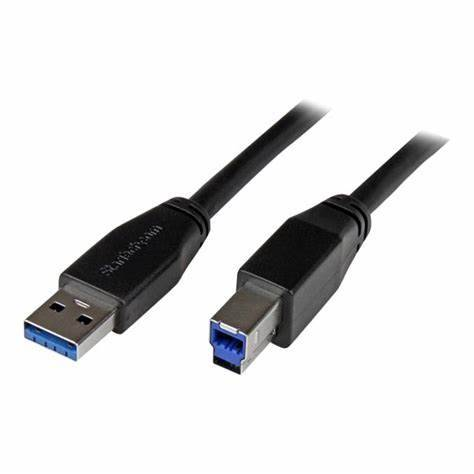

图为USB Type-B

USB Type-B常出现在打印机链接与USB拓展坞上

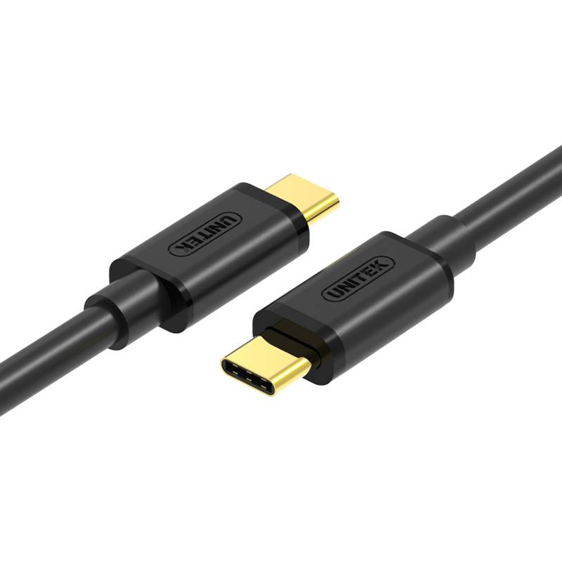

图为USB Type-C，是目前新型电子设备最常用的接口。

USB Type-C，常出现在安卓手机、笔记本电脑、iPad Pro、Mac等电子设备上

##### 二、HDMI（高清接口）及高清线

全称为：高清多媒体接口（High Definition Multimedia Interface，HDMI ） 常用于机顶盒、DVD播放机、个人计算机、电视、投影仪、游戏主机与数字音响等设备，可同时传输视频与音频的讯号。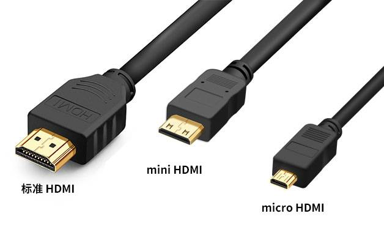

图为三种HDMI类型，其中标准HDMI最常见，mini与micro一般出现在数码相机等需要图像输出的移动设备上。

##### 三、VGA接口及VGA线

VGA线，全称为Video Graphics Array，VGA接口是个人电脑显卡上的输出模拟信号的接口，通过VGA接口可将电脑主机（显卡）与显示屏相连，从而将电脑画面显示在显示屏上。

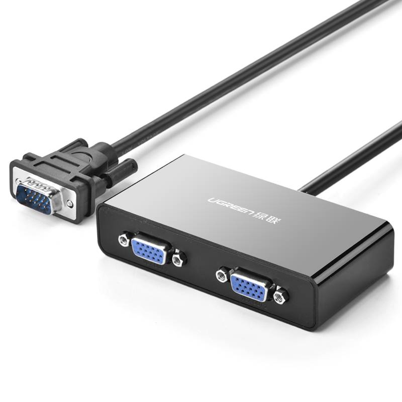图为VGA接口（左公，右母)，常见于电脑主机与投影机上，逐渐淘汰中。

##### 四、DVI接口以及DVI线

DVI（Digital Visual Interface）， 数字视频接口（DVI）是一种国际开放的接口标准，在PC、DVD、高清晰电视（HDTV）、高清晰投影仪等设备上有广泛的应用。

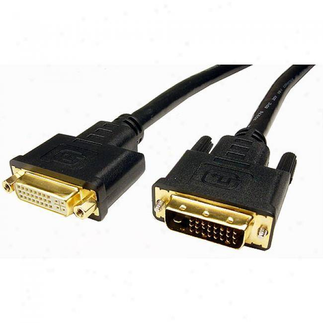

图为DVI接口，基本被淘汰

##### 五、DP接口以及DP线

DP（DisplayPort）接口是由PC及芯片制造商联盟开发，视频电子标准协会标准化的数字式视频接口标准，是数据传输技术的显示通信端口。可通过主动或被动适配器取代传统的VGA、DVI接口。

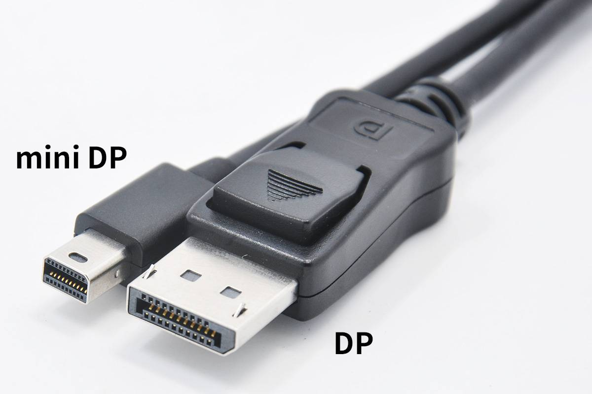图为2种常见的DP接口，其中DP接口与HDMI接口类似，常出现在各种新款电子设备上用于高清视频的传输，而mini DP则常出现在笔记本电脑上。

###### 如何区分DP接口与HDMI接口：

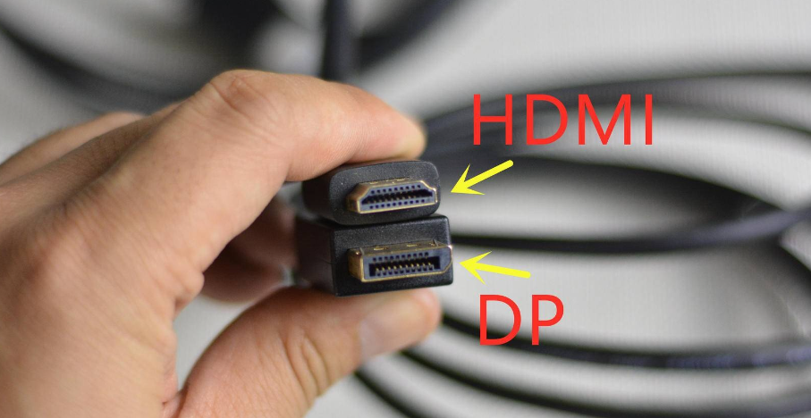

HDMI形状类似等腰梯形，而DP接口是直角梯形。

###### 注意：DP接口是有锁接口，拔下需先按住解锁

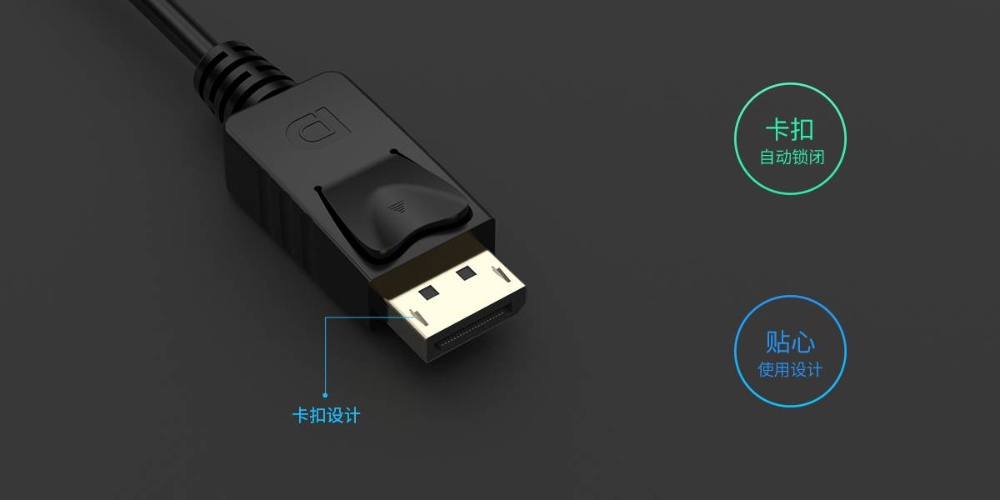

##### 六、3.5mm 耳机接口

 3.5mm插头是指直径为3.5mm的同轴音频插头。它是一种常用于连接音响设备，用以传递音频信号的连接器。

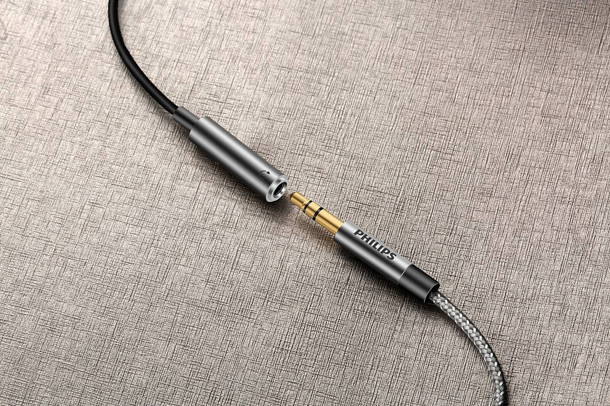

图为3.5mm耳机接口，曾经它会出现在每一台手机与电脑上，现在因为手机集成度越来越高，很多厂家放弃配备这种接口，但你仍然可以在笔记本电脑与台式电脑主机上见到它。

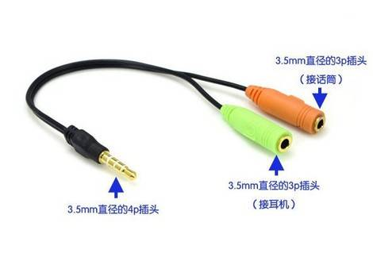

虽然同为3.5mm耳机接口，但它分为单耳机、单话筒（麦克风）、耳机话筒二合一这三种接口。

耳机插在电脑上没声音？那多半是因为你把耳机插在了单话筒的接口上了。