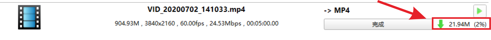

# 超大视频怎么上传卓越云

###### 这里的“超大视频”是指手机或相机拍摄后未经压缩的原视频。直接使用视频原片上传不仅上传的慢、更占用空间，在观看时也会更卡顿，甚至是直接上传失败。

### 超大的视频怎样上传才好呢？请看下面的详细教程：

##### 1.将手机中的视频文件导出到电脑上，安卓手机（不包括华为）请 [点击此处](/docs/docs/docs_md/如何将手机的视频有线传输到电脑上（安卓手机）/如何将手机的视频有线传输到电脑上（安卓手机）.md) 移步 ，苹果与华为手机请 [点击此处](/docs/docs_md/跨平台文件传输工具——快牙使用教程/跨平台文件传输工具——快牙使用教程.md) 移步 。

##### 2.使用格式工厂来压缩视频文件，格式工厂的下载与使用教程请[点击这里](/docs_md/怎么压缩视频？（格式工厂使用教程）/怎么压缩视频？（格式工厂使用教程）.md)。

可以看到视频缩小了很多，从900M压缩到21M（牺牲画质）。

##### 3.在浏览器中访问卓越云网页版。

https://osdzhuoyue.synology.me:5301/

##### 4.登录，账号与手机端DS file的是一样的。

##### 5.在卓越云网页版中使用File Station文件管理系统寻找你将要上传的地址。

##### 6.找到正确的地址后在File Station空白处单击鼠标右键选择→上传至 XXX→上传-忽略。

##### 7.上传提示在卓越云网页版的右上角显示。

