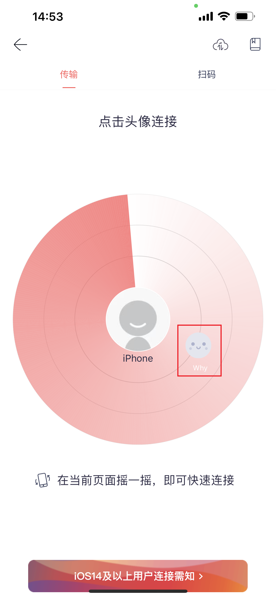

# 如何将手机的视频无线传输到电脑上（推荐苹果与华为使用）

###### **跨平台文件传输工具——快牙使用教程（安卓、苹果、Windows等全平台通用）**

#### 推荐iOS设备（苹果手机）与鸿蒙设备（华为手机）使用此软件传输文件至电脑

##### 1.手机下载快牙，手机打开App Store或应用商城搜索”快牙“下载安装

##### 2.电脑下载快牙，点击 [首页 (kuaiya.cn)](https://www.kuaiya.cn/) 进入主页

点击”下载“进入下载页

根据你的电脑系统选择下载

##### 3.安装快牙

点击”自定义安装“查看

确认安装路径与勾选项目无误后点击”立即安装“

安装完成后点击”立即体验“

##### 4.连接

确保你的电脑与手机在同一个网络环境下

电脑上确认名称后，在手机上打开快牙

点击双向箭头图标

选择你的电脑

连接完成后会显示这个界面

选择你想要传输的视频

点击下方”全部传输“按钮，进行传输

稍等片刻后，传输完成了！

在电脑上点击右侧文件夹图标打开视频所在位置

